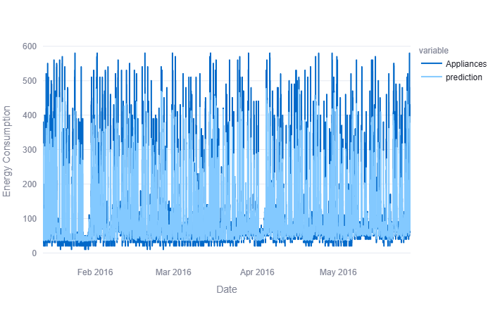
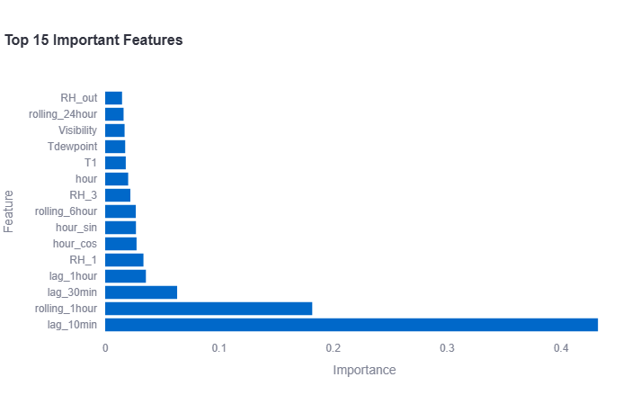
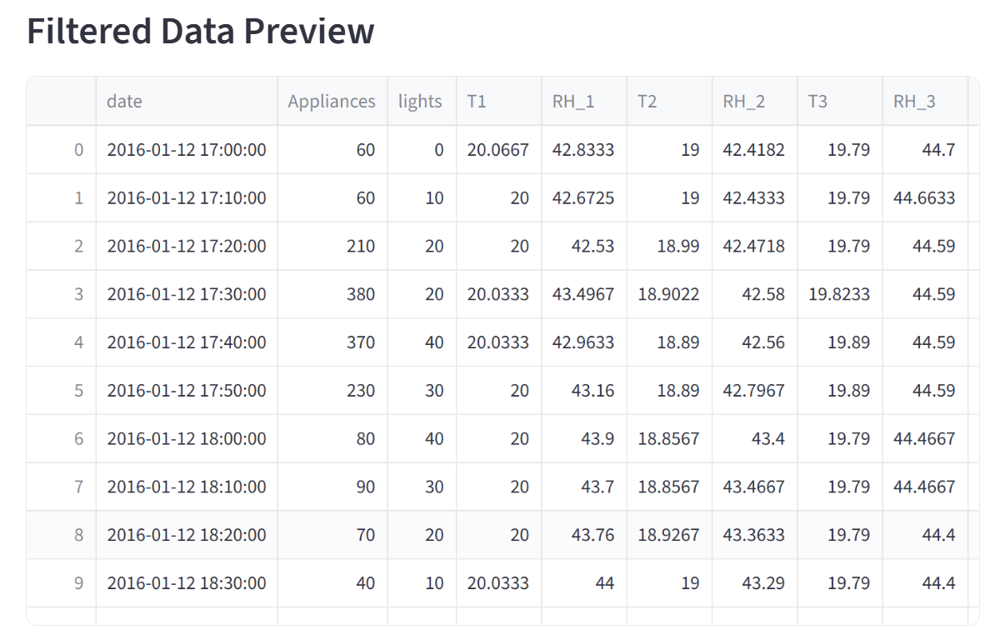

# Energy-Forecasting
Time-series machine learning pipeline that forecasts household energy consumption.

**The Dataset**
UCI Appliances Energy Prediction dataset.  
It contains energy consumption readings from a low-energy house, measured every 10 minutes, along with temperature and humidity sensors across multiple rooms.  
Download here: [UCI Appliances Energy Prediction Dataset](https://archive.ics.uci.edu/dataset/374/appliances+energy+prediction).  
The dataset includes: timestamps, appliance energy use (Wh), lights energy use (Wh), temperature
and humidity across 9 rooms, outdoor weather data (temperature, humidity, wind speed, visibility, dew
point).

### Exploratory Data Analysis
The dataset was analyzed using Pandas, DuckDB and Plotly  

SQL queries with DuckDB were used to calculate average consumption by hour, average consumption by weekday, monthly trends.  

#### Hourly Energy Consumption Breakdown using SQL

| Time Window | Consumption (Units) | Category | Description |
| :--- | :--- | :--- | :--- |
| **00:00 - 04:00** | 48 – 52 | **Baseload** | Always-on appliances (refrigerators, standby electronics). |
| **06:00 - 08:00** | 57.7 → 106.1 | **Morning Rise** | Initial spike due to morning routines and breakfast. |
| **11:00** | 133.13 | **Secondary Peak** | Mid-day activity or small commercial operations. |
| **18:00** | 190.36 | **Primary Peak** | Evening surge (HVAC, cooking, and entertainment). |

**Weekly Anomalies**: Monday represents the **highest usage day (111.45)**, showing a sharp increase compared to Tuesday (87.12). This suggests a weekly "catch-up" period for chores or specific operational start-up routines.   

**Seasonal Stability**: Monthly consumption is exceptionally **consistent**, maintaining a narrow range of 94–100 units. This indicates that energy draw is tied to year-round appliances or fixed processes rather than seasonal heating or cooling.  

### Feature Engineering ###

Several time-series forecasting features were created Eg. hour of day, day of week, month, weekend indicator, Lag Features  
Historical consumption patterns were captured using 1-hour lag, 24-hour lag  
Rolling averages were added to smooth short-term fluctuations: 3-hour rolling mean, 6-hour rolling mean
24-hour rolling mean.

**Data Cleaning**  
Missing values handled using forward/backward fill.  
Outliers capped using IQR-based clipping.  

### Machine Learning Models ###
1. Linear Regression - Simple baseline model.  
2. Random Forest Regressor - Captured non-linear relationships and feature interactions.  
3. XGBoost Regressor - Provided the strongest predictive performance due to gradient boosting, handling non-linearity and robustness to noisy tabular data

### Tech Stack ###
Programming Language - Python, IDE - Visual Studio Code, Data Processing -	Pandas, SQL Analytics - DuckDB, Machine Learning - scikit-learn, Gradient Boosting - XGBoost, Experiment Tracking -	MLflow, 
Dashboarding -	Streamlit, Visualization - Plotly, Model Serialization - joblib, Version Control - GitHub. 


### Dashboard Preview ###

#### Main Dashboard



#### Feature Importance



## Filtered Data Preview




### Results & KPIs ###
**Evaluation Metrics** :RMSE, MAE, R².   


**Model Comparison**  

Linear Regression -	Weak baseline performance  
MAE: 35.41614364956966, RMSE: 66.78964633340513, R2: 0.22049432925090118     
Random Forest -	Improved non-linear prediction    
MAE: 35.95548436456531, RMSE: 65.11420778064401, R2: 0.25911208055494683  
XGBoost	Best overall accuracy  
MAE: 35.01264456031249, RMSE: 64.64315640927137, R2: 0.26979281897184126  
### What I Learned ###
1. Time-Series Feature Engineering Is Critical - Lag variables and rolling averages significantly improved forecasting accuracy.

2. Simpler Models Are Useful Baselines - Linear Regression established a benchmark for evaluating more advanced models.

3. Tree-Based Models Handle Real-World Data Better - Random Forest and XGBoost handled noise, non-linearity, outliers more effectively than linear models.

4. MLflow Simplifies Experiment Tracking : Made it easy to compare experiments, store parameters
track metrics, save trained models

5. Streamlit Enables Rapid Deployment - Allowed the project to be converted into an interactive dashboard quickly with minimal frontend code.

### What Surprised Me ###
Lag features had extremely high predictive power. Daily seasonality was stronger than monthly seasonality. XGBoost handled noisy consumption spikes surprisingly well. Even relatively simple engineered features produced strong forecasting results.  

### Data Improvements ###
Add external weather APIs, Real-time prediction updates, MLOps Enhancements, Automated retraining pipeline, Docker deployment, Cloud deployment using AWS/Azure/GCP, Add streaming ingestion pipelines

# Project Structure

```text
Energy-Forecasting/
│
├── app.py
├── requirements.txt
├── data/
│   ├── energy_features.csv
│   └── energydata_complete.csv
├── models/
│   └── xgboost_model.pkl
├── src/
│    ├── data_inspection.py
│    ├── duckdb_analysis.py
│    ├── feature_engineering.py
│    ├── plot_timeseries.py
│    └── train_models.py
├── asset/
│    └── screenshots/
│        ├── Feature_importance.png
│        ├── filtered_data_preview.png
│        └── predicted_energy.png
└── README.md
```

---

# How to Run

## Step 1 — Clone the Repository

```bash
git clone <https://github.com/Archana-Thakare/Energy-Forecasting.git>
cd Energy-Forecasting
```

---

## Step 2 — Download the Dataset

Download:

* `energydata_complete.csv`

From:
https://archive.ics.uci.edu/dataset/374/appliances+energy+prediction

Place it in:

```text
data/
```

---

## Step 3 — Create a Virtual Environment

### Windows

python -m venv venv

Activate it:

venv\Scripts\activate


### macOS/Linux

python3 -m venv venv

source venv/bin/activate

## Step 4 — Install Dependencies

pip install -r requirements.txt

## Step 5 — Verify Required Files Exist

The following files should already be in the repository:

data/energy_features.csv

models/xgboost_model.pkl

## Step 6 —Launch the Dashboard
streamlit run app.py

## Step 7 — Open the Dashboard
Streamlit will display something similar to:
Local URL: http://localhost:8501 in browser

### Conclusion ###
This project successfully built an end-to-end machine learning pipeline for energy consumption forecasting, covering data ingestion, feature engineering, exploratory analysis, predictive modeling, experiment tracking, interactive dashboard deployment.  

Among all tested models, XGBoost delivered the best forecasting performance and demonstrated the effectiveness of feature-engineered machine learning approaches for energy prediction tasks.